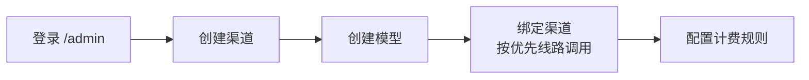

# Doodle Canvas

<p align="center">
  
</p>

<p align="center">
  <strong>🎨 可视化 AI 创作画布 — 全栈平台：节点编排 · 多模型代理 · 账号计费 · 文件管理 · 管理后台</strong>
</p>

<p align="center">
  <a href="https://github.com/kggzs/Doodle-Canvas">
    
  </a>
  <a href="https://github.com/kggzs/Doodle-Canvas/blob/main/LICENSE">
    
  </a>
  
  
  
  
  
  
</p>

<p align="center">
  <b>
    <a href="#-能力概览">能力概览</a> •
    <a href="#-快速开始">快速开始</a> •
    <a href="#-截图">截图</a> •
    <a href="#-项目结构">项目结构</a> •
    <a href="#-部署">部署</a> •
    <a href="#-API">API</a>
  </b>
</p>

---

## ✨ 能力概览

> 一个融合 **节点式工作流编排** 与 **多模型 AI 生成** 的全栈创作平台。前端拖拽连线，后端统一代理模型调用，提供完整的计费、文件与管理系统。

### 🎯 核心功能

| 模块 | 能力 |
|:--- |:--- |
| 🖼️ **可视化画布** | 文本、图片、视频、LLM 配置等节点拖拽编排，连线即工作流 |
| 🤖 **AI 工作流** | 文生图、图生视频、分镜、多角度角色、电商产品图、儿童绘本等预设工作流 |
| 👤 **用户系统** | 邮箱注册/登录、邮箱验证、Refresh Token 会话管理、用户状态控制 |
| 🔌 **后端化模型调用** | 前端不存第三方 Key，所有 chat / image / video 统一走 `/api` |
| ⚙️ **模型与渠道** | 按 chat / image / video 三类维护模型、上游渠道、优先线路与计费规则 |
| 🪙 **金币计费** | 余额查询、流水记录、费用预估、生成预扣、失败退款、用户组倍率 |
| ☁️ **云端项目** | 项目列表、画布节点/边/视口自动保存、缩略图 |
| 📁 **文件存储** | 上传图片、生成图片/视频统一管理，`/storage/*` 访问鉴权 |
| 🔐 **管理后台** | 仪表盘、用户、用户组、金币、生成记录、文件、错误日志、模型配置、公告 |
| 🛡️ **安全防护** | Helmet、CORS、全局限流、JWT 类型校验、AES-256-GCM 加密、SSRF 防护、MIME 嗅觉 |

---

## 🛠️ 技术栈

<p align="center">
  
</p>

| 层级 | 技术 |
|:--- |:--- |
|  **前端** | Vue 3、Vite 5、Vue Router、Pinia、Naive UI、Tailwind CSS、Vue Flow |
|  **后端** | Node.js、Express、Sequelize、MySQL、Redis、Multer、Sharp、Winston |
|  **部署** | 单 Node 服务托管 `dist/`、PM2 进程管理、Nginx 反向代理 |

---

## 🚀 快速开始

### 📋 环境要求

| 依赖 | 版本要求 |
|:--- |:--- |
| **Node.js** | ⩾ 18（推荐 20+） |
| **MySQL** | 8.x 或兼容版本 |
| **Redis** | 6.x 或更高 |
| **包管理** | npm |

### ⚡ 起步步骤

<details open>
<summary><b>1️⃣ 安装依赖</b></summary>

```bash
npm install --include=dev --no-audit
npm --prefix server install --include=dev --no-audit
```
</details>

<details open>
<summary><b>2️⃣ 初始化数据库</b></summary>

```bash
mysql -u root -p < server/sql/init.sql
```

> 新部署只需执行 `init.sql`，**不要**叠加历史升级脚本。
</details>

<details open>
<summary><b>3️⃣ 配置后端</b></summary>

```bash
copy server\.env.example server\.env
```

至少填写以下配置项：

| 配置 | 说明 |
|:--- |:--- |
| `DB_HOST` | 数据库地址 |
| `DB_PORT` | 数据库端口 |
| `DB_NAME` | 数据库名称 |
| `DB_USER` | 数据库用户 |
| `DB_PASS` | 数据库密码 |

> 💡 缺少 `JWT_SECRET` 和 `AES_SECRET_KEY` 时，后端会自动生成到 `server/.runtime.env`；**请备份该文件且不要提交到版本库**。密钥丢失会导致历史 JWT 失效、渠道 API Key 无法解密。

</details>

<details open>
<summary><b>4️⃣ 启动服务</b></summary>

```bash
npm run dev
```
</details>

<details open>
<summary><b>5️⃣ 创建管理员</b></summary>

```bash
npm run create-admin -- --email admin@example.com --username admin --password Admin123456
```
</details>

### 🌐 访问地址

| 入口 | 地址 |
|:--- |:--- |
| 🏠 **前台首页** | [http://localhost:3000/](http://localhost:3000/) |
| 📂 **项目列表** | [http://localhost:3000/projects](http://localhost:3000/projects) |
| 🔧 **管理后台** | [http://localhost:3000/admin](http://localhost:3000/admin) |
| 💚 **健康检查** | [http://localhost:3000/api/health](http://localhost:3000/api/health) |

---

## 📖 常用命令

| 命令 | 说明 |
|:--- |:--- |
| `npm run dev` | 构建前端 → 启动后端（生产模式单服务） |
| `npm run build` | 仅构建前端到 `dist/` |
| `npm run start` | 仅启动后端（自动托管 `dist/`） |
| `npm run server:dev` | 使用 nodemon 热重载开发后端 |
| `npm run create-admin -- ...` | 创建管理员账号 |
| `npm --prefix server run upgrade-core-features` | 存量数据库升级辅助 |
| `npm --prefix server run backfill-generated-files` | 回填历史生成记录中的外链文件 |

---

## ⚙️ 后台配置模型

模型调用必须先在 **管理后台** 完成配置：



### 📌 配置步骤

1. 登录 [`/admin`](http://localhost:3000/admin)
2. 进入 **模型管理** → 选择类型：`chat` / `image` / `video`
3. **创建渠道** — 填写 Provider、Base URL、API Key
4. **创建模型** — 填写调用模型名和用户显示名
5. **绑定渠道** — 绑定同类型渠道，可增删多线路；生成时按优先级排序，选取第一条可用线路
6. **配置计费规则** — 设定模型固定金币价格

### 🔌 支持的 Provider

| Provider | 适用类型 | 默认端点方向 |
|:--- |:--- |:--- |
| `openai` | chat / image / video | OpenAI 兼容接口 |
| `aliyun` | image / video / chat | DashScope / 百炼 |
| `doubao` | image / chat | Volcengine Ark |
| `stepfun` | image / chat | StepFun 兼容接口 |
| `agnes` | chat / image / video | Agnes AI |
| `custom` | chat / image / video | 自定义 OpenAI 兼容接口 |

> 💡 用户侧 `GET /api/models` 只返回**「模型启用 + 至少一个同类型启用渠道绑定 + 渠道未熔断」**的模型。

---

## 🖼️ 截图

<p align="center">
  
  
  <br/>
  
  
</p>

---

## 📂 项目结构

<details>
<summary><b>点击展开目录树</b></summary>

```text
📦 Doodle-Canvas
├── 📁 src/                     # 前端源码
│   ├── 📁 api/                 # API 封装层（axios）
│   ├── 📁 components/          # 画布节点、边、应用壳组件
│   ├── 📁 config/              # 工作流与默认展示配置
│   ├── 📁 hooks/               # 组合式逻辑 & 工作流编排
│   ├── 📁 router/              # 前台/后台路由与守卫
│   ├── 📁 stores/              # 认证、画布、项目、模型、主题
│   └── 📁 views/               # 首页、画布、账号、管理后台页面
│
├── 📁 server/                  # 后端源码
│   ├── 📁 src/
│   │   ├── 📄 app.js           # Express 入口 & 静态托管
│   │   ├── 📁 routes/          # 用户侧与管理侧 API
│   │   ├── 📁 services/        # 认证、计费、生成、文件等服务
│   │   ├── 📁 models/          # Sequelize 模型
│   │   ├── 📁 middleware/      # 鉴权、限流、审计上下文
│   │   ├── 📁 utils/           # 响应、日志、加密、IP/UA 工具
│   │   └── 📁 scripts/        # 创建管理员、升级、回填脚本
│   └── 📁 sql/                 # 初始化 & 升级 SQL
│
├── 📁 doc/                     # 文档与截图
│   ├── 📄 all-sql-merged.sql   # 完整 SQL 合并归档
│   └── 🖼️ *.png               # 截图
│
├── 📁 dist/                    # 前端构建产物
├── 📄 package.json
└── 📄 README.md
```
</details>

---

## 🔌 API 概览

统一前缀：`/api`

### 👤 用户侧 API

| 分类 | 端点 |
|:--- |:--- |
| **🔐 认证** | `POST /api/auth/register` · `POST /api/auth/login` · `POST /api/auth/refresh` · `GET /api/auth/me` · `POST /api/auth/logout` · `PUT /api/auth/password` · `POST /api/auth/forgot-password` · `POST /api/auth/reset-password` · `GET /api/auth/sessions` · `DELETE /api/auth/sessions/:id` |
| **📋 模型** | `GET /api/models` · `GET /api/models/:type` · `GET /api/models/detail/:idOrKey` |
| **🎨 生成** | `POST /api/generate/image` · `POST /api/generate/video` · `GET /api/generate/video/:taskId` |
| **💬 对话** | `POST /api/chat/completions` · `POST /api/chat/completions/stream` |
| **🪙 金币** | `GET /api/coins/balance` · `GET /api/coins/summary` · `GET /api/coins/transactions` |
| **💰 计费** | `GET /api/billing/pricing` · `GET /api/billing/estimate` |
| **📝 记录** | `GET /api/records` · `GET /api/records/:id` |
| **📁 项目** | `GET /api/projects` · `POST /api/projects` · `GET /PUT /DELETE /api/projects/:id` |
| **🗂️ 文件** | `POST /api/upload/image` · `POST /api/upload/video` · `GET /api/files/:id` · `DELETE /api/files/:id` |
| **📢 公告** | `GET /api/announcements/latest` · `GET /api/announcements/:id` |
| **💚 探针** | `GET /api/health`（存活） · `GET /api/ready`（就绪） |

### 🔒 管理侧 API

```text
/api/admin/dashboard/*        —— 仪表盘
/api/admin/users/*            —— 用户管理
/api/admin/user-groups/*      —— 用户组管理
/api/admin/coins/*            —— 金币管理
/api/admin/models/*           —— 模型配置
/api/admin/channels/*         —— 渠道管理
/api/admin/billing/*          —— 计费规则
/api/admin/records/*          —— 生成记录
/api/admin/files/*            —— 文件管理
/api/admin/error-logs/*       —— 错误日志
/api/admin/announcements/*    —— 公告管理
```

> 管理端所有接口需登录且用户角色为 `admin`。

---

## 🚢 部署

### 部署模型

```
Nginx → Node (Express) → MySQL + Redis
         ↑ 托管 dist/ 静态文件
```

### 快速部署

```bash
# 1. 拉取 & 安装生产依赖
git clone https://github.com/kggzs/Doodle-Canvas.git
cd Doodle-Canvas
npm install --omit=dev --no-audit
npm --prefix server install --omit=dev --no-audit

# 2. 初始化数据库
mysql -u root -p < server/sql/init.sql

# 3. 配置环境变量
copy server\.env.example server\.env
# 编辑 server/.env，至少填写 DB_* 和 REDIS_*

# 4. 构建前端 + 启动
npm run build
npm run start
```

### PM2 进程管理

```bash
pm2 start server/src/app.js --name doodle-canvas
pm2 save
```

或直接使用仓库内 `server/ecosystem.config.js`（需按服务器路径调整环境变量）。

### Nginx 反向代理

```nginx
server {
    listen 80;
    server_name your-domain.example;

    client_max_body_size 50m;

    location / {
        proxy_pass http://127.0.0.1:3000;
        proxy_http_version 1.1;
        proxy_set_header Host $host;
        proxy_set_header X-Real-IP $remote_addr;
        proxy_set_header X-Forwarded-For $proxy_add_x_forwarded_for;
        proxy_set_header X-Forwarded-Proto $scheme;
    }
}
```

生产环境建议开启 HTTPS 并将 HTTP 重定向到 HTTPS。

### 部署后检查

```bash
curl http://127.0.0.1:3000/api/health   # → { status: "ok" }
curl http://127.0.0.1:3000/api/ready    # → MySQL、Redis、存储均 ok
pm2 logs doodle-canvas
```

### 安全注意事项

| 事项 | 说明 |
|:--- |:--- |
| 🔑 **密钥备份** | `server/.runtime.env` 包含自动生成的 JWT_SECRET 和 AES_SECRET_KEY，**必须备份** |
| 🔒 **密钥不提交** | `.env`、`.runtime.env`、`storage/` 不应提交到版本库 |
| 🔐 **多实例一致** | 多实例部署必须共享同一组 `JWT_SECRET` / `AES_SECRET_KEY` |
| 🗄️ **数据库备份** | 升级前备份数据库，避免叠加执行历史升级脚本 |


---

## 📄 License

**MIT** © [kggzs](https://github.com/kggzs)

---

<p align="center">
  <sub>⭐ 如果这个项目对你有帮助，欢迎 Star！</sub>
  <br>
  <sub>Built with ❤️ using Vue 3 & Express</sub>
</p>