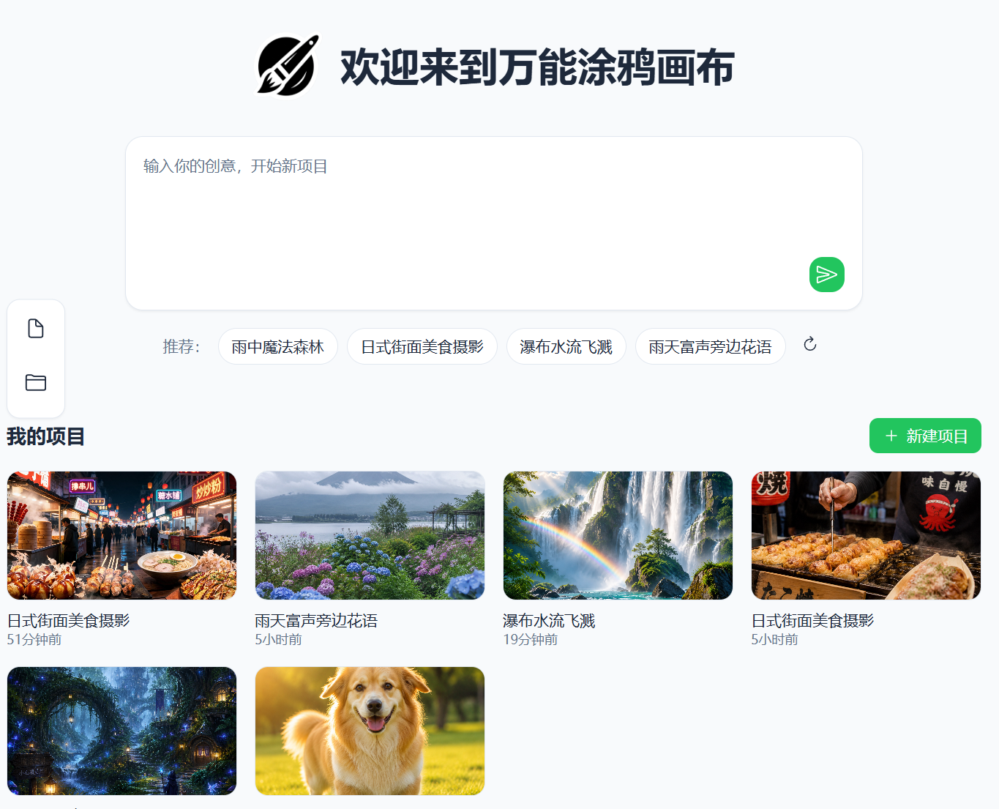
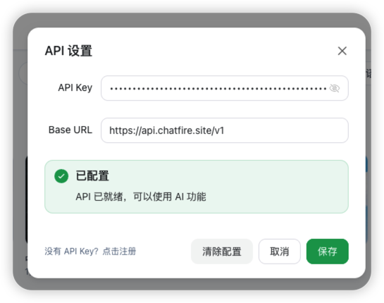

# AI Canvas

一个基于 Vue Flow 的可视化 AI 创作画布，支持文生图、视频生成、分镜设计、绘本创作等多种 AI 工作流的节点式编排。


项目地址：[doodle-canvas](https://github.com/kggzs/doodle-canvas)

## 📸 截图

### 首页


### 画布


### API 配置


## ✨ 特性

- 🎨 **可视化节点编排** - 基于 Vue Flow 的无限画布，支持拖拽、缩放、连接节点
- 🖼️ **文生图工作流** - 支持配置提示词、模型、尺寸、画质等参数生成高质量图片
- 🎬 **视频生成工作流** - 支持图生视频和文生视频，可设置首帧/尾帧图片、时长、分辨率
- 🤖 **AI 提示词润色** - 一键 AI 优化提示词，提升生成质量，支持多种对话模型
- 🎭 **多角度分镜** - 自动生成正视、侧视、后视、俯视四宫格分镜图，保持角色一致性
- 📚 **儿童绘本创作** - 角色生成 → 剧情拆分 → 绘本插画，完整绘本创作流程
- 🎬 **短剧角色设计** - 根据角色描述生成一致性角色形象，支持多角度图生成
- 🛍️ **电商产品图** - 一键生成模特图、侧面展示图、俯瞰展示图、拆解图
- 🌓 **深色/浅色主题** - 支持主题切换，保护眼睛
- 💾 **本地项目存储** - 项目数据本地持久化，支持多项目管理
- ↩️ **撤销/重做** - 完整的操作历史记录
- 🔗 **多 API 渠道** - 支持 OpenAI、阿里云万相、豆包等多种 API 渠道

## 📦 节点类型

| 节点 | 描述 |
|------|------|
| **文本节点** | 输入/编辑提示词文本，支持 AI 润色功能，可连接图片节点作为参考 |
| **文生图配置** | 配置图片生成参数（模型、尺寸、画质、数量等），支持参考图输入 |
| **图片节点** | 展示生成的图片或上传本地图片，可作为其他节点的参考图输入 |
| **视频生成配置** | 配置视频生成参数（模型、分辨率、时长），支持首帧/尾帧图片输入 |
| **视频节点** | 展示生成的视频 |
| **LLM 配置节点** | 大语言模型配置节点，用于 AI 提示词生成、剧情拆分等智能处理 |

## 🎯 支持的模型

### 图片生成模型

| 模型 | 提供商 | 特点 |
|------|--------|------|
| **豆包 Seedream 5.0** | 豆包 | 推荐，支持多种比例，可选 4K 高清画质 |
| **万相 2.7 Pro** | 阿里云 | 推荐，支持 1K/2K/4K 分辨率，thinking_mode 深度思考 |
| **万相 2.7** | 阿里云 | 支持 1K/2K 分辨率，thinking_mode 深度思考 |

### 视频生成模型

| 模型 | 提供商 | 类型 | 特点 |
|------|--------|------|------|
| **万相 2.7 图生视频** | 阿里云 | 图生视频 | 推荐，支持 720P/1080P，2-15 秒时长 |
| **万相 2.7 文生视频** | 阿里云 | 文生视频 | 推荐，支持 720P/1080P，2-15 秒时长 |

### 对话模型

| 模型 | 提供商 | 用途 |
|------|--------|------|
| **GPT-4o Mini** | OpenAI | 提示词润色、意图分析 |
| **GPT-4o** | OpenAI | 高级提示词生成、剧情拆分 |
| **GPT-5.2** | OpenAI | 最强对话能力 |
| **DeepSeek Chat** | OpenAI | 中文优化 |
| **Gemini 3 Pro** | OpenAI | 多模态理解 |
| **DeepSeek V4 Flash** | 豆包 | 快速响应 |

## 🔌 API 渠道配置

支持三种主要 API 渠道：

| 渠道 | 描述 | 默认 Base URL |
|------|------|---------------|
| **OpenAI** | OpenAI 兼容 API | `https://ai.kggzs.cn` |
| **阿里云万相** | 阿里云 DashScope API | `https://dashscope.aliyuncs.com/api/v1` |
| **豆包** | 字节跳动豆包 API | `https://ark.cn-beijing.volces.com` |

配置方式：
1. 点击右上角设置图标 ⚙️
2. 选择 API 渠道
3. 填入 API Base URL 和 API Key
4. 选择需要使用的模型

## 🚀 快速开始

### 环境要求

- Node.js >= 18
- pnpm / npm / yarn

### 安装

```bash
# 克隆项目
git clone https://github.com/kggzs/doodle-canvas.git
cd doodle-canvas

# 安装依赖
pnpm install
# 或
npm install

# 启动开发服务器
pnpm dev
# 或
npm run dev
```

### 构建

```bash
pnpm build
# 或
npm run build
```

##  自动执行工作流

开启「自动执行」模式后，系统会通过 AI 分析用户意图，自动编排并执行工作流。

### 工作流类型

| 类型 | 触发条件 | 说明 |
|------|---------|------|
| `text_to_image` | 默认 | 文生图工作流 |
| `text_to_image_to_video` | 包含"视频"、"动画"等关键词 | 文生图生视频工作流 |
| `storyboard` | 包含"分镜"、"场景"、"镜头"等关键词 | 分镜工作流 |
| `multi_angle_storyboard` | 包含"多角度"、"正视"、"侧视"等关键词 | 多角度分镜工作流 |
| `picture_book` | 包含"绘本"、"故事书"、"童话"等关键词 | 儿童绘本工作流 |

### 预设工作流模板

| 模板 | 描述 | 应用场景 |
|------|------|---------|
| **多角度分镜** | 生成角色的正视、侧视、后视、俯视四宫格分镜图 | 角色设计、产品展示 |
| **通用产品全套电商图** | 生成模特图、侧面展示图、俯瞰展示图、拆解图 | 电商产品展示 |
| **短剧角色设计** | 根据角色描述生成一致性角色形象，支持多角度图 | 短剧、动画角色设计 |
| **多时段场景背景** | 先生成基础场景，再生成多时段变体（傍晚、夜晚、雨天） | 场景设计、氛围变化 |
| **儿童绘本生成** | 角色生成 → 剧情拆分 → 绘本插画，支持角色一致性 | 儿童绘本创作 |

### 工作流 1: 文生图 / 文生图生视频


### 工作流 2: 分镜工作流 (Storyboard)


**示例输入:** `蜡笔小新去上学。分镜一：清晨的战争；分镜二：出发的风姿`

**AI 解析:**
- 提取角色: 蜡笔小新 (外观描述)
- 拆分分镜: 清晨的战争、出发的风姿

**执行流程:**
1. 生成角色参考图
2. 依次生成各分镜图片 (连接角色参考图保持一致性)

### 执行流程

1. **AI 意图分析** - 分析用户输入，判断工作流类型，生成优化后的提示词
2. **创建节点** - 按顺序创建文本节点和配置节点
3. **串行执行** - 配置节点自动执行，等待上一步完成后再执行下一步
4. **输出结果** - 生成图片/视频节点展示结果

### 核心组件

- `useWorkflowOrchestrator` - 工作流编排器 Hook
- `waitForConfigComplete` - 等待配置节点完成
- `waitForOutputReady` - 等待输出节点就绪

## 🛠️ 技术栈

- **框架**: [Vue 3](https://vuejs.org/) + [Vite](https://vitejs.dev/)
- **画布**: [Vue Flow](https://vueflow.dev/)
- **UI 组件**: [Naive UI](https://www.naiveui.com/)
- **样式**: [Tailwind CSS](https://tailwindcss.com/)
- **图标**: [@vicons/ionicons5](https://www.xicons.org/)
- **路由**: [Vue Router](https://router.vuejs.org/)
- **状态管理**: [Pinia](https://pinia.vuejs.org/)

## 📁 项目结构

```
src/
├── api/              # API 请求封装
│   ├── chat.js       # 对话 API
│   ├── image.js      # 图片生成 API
│   ├── video.js      # 视频生成 API
│   └── model.js      # 模型配置 API
├── assets/           # 静态资源
├── components/       # 组件
│   ├── nodes/        # 节点组件
│   │   ├── TextNode.vue          # 文本节点
│   │   ├── ImageConfigNode.vue   # 图片配置节点
│   │   ├── ImageNode.vue         # 图片节点
│   │   ├── VideoConfigNode.vue   # 视频配置节点
│   │   ├── VideoNode.vue         # 视频节点
│   │   └── LLMConfigNode.vue     # LLM 配置节点
│   └── edges/        # 边组件
│       ├── PromptOrderEdge.vue   # 提示词顺序边
│       ├── ImageOrderEdge.vue    # 图片顺序边
│       └── ImageRoleEdge.vue     # 图片角色边
├── config/           # 配置文件
│   ├── models.js     # 模型配置
│   ├── providers.js  # API 渠道配置
│   └── workflows.js  # 工作流模板配置
├── hooks/            # 组合式函数
│   ├── useWorkflowOrchestrator.js  # 工作流编排器
│   ├── useApi.js                    # API 调用
│   ├── useApiConfig.js              # API 配置管理
│   └── useProvider.js               # 渠道管理
├── stores/           # 状态管理
│   ├── canvas.js     # 画布状态
│   ├── api.js        # API 状态
│   ├── models.js     # 模型状态
│   ├── projects.js   # 项目状态
│   └── theme.js      # 主题状态
├── utils/            # 工具函数
│   ├── constants.js  # 常量定义
│   ├── request.js    # 请求工具
│   └── schema.js     # 数据结构定义
├── views/            # 页面视图
│   ├── Home.vue      # 首页
│   └── Canvas.vue    # 画布页面
├── router/           # 路由配置
└── main.js           # 入口文件
```

## 🙏 致谢

本项目基于 [huobao-canvas](https://github.com/chatfire-AI/huobao-canvas) 修改而来，感谢原作者的开源贡献。

## �📄 License

[MIT](./LICENSE)
