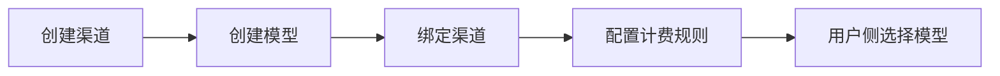

# 模型与渠道配置

更新时间：2026-06-21

## 配置路径

管理后台入口：

```text
/admin
```

配置顺序：



## Provider 类型

| Provider | 类型 | 说明 |
| --- | --- | --- |
| `openai` | chat / image / video | OpenAI 或兼容接口 |
| `aliyun` | chat / image / video | DashScope / 百炼 |
| `doubao` | chat / image | Volcengine Ark |
| `stepfun` | chat / image | StepFun 兼容接口 |
| `agnes` | chat / image / video | Agnes AI |
| `custom` | chat / image / video | 自定义 OpenAI 兼容接口 |

## 渠道字段

| 字段 | 说明 |
| --- | --- |
| 名称 | 管理端展示名称 |
| Provider | 上游适配器类型 |
| 模型类型 | `chat`、`image`、`video` |
| Base URL | 上游 API 根地址 |
| API Key | 后端加密保存，不返回前端 |
| 优先级 | 越小越优先 |
| 权重 | 加权随机策略下使用 |
| 超时 | 上游请求超时时间 |
| 配置 JSON | 自定义 headers、endpoints 等扩展参数 |

## 模型字段

| 字段 | 说明 |
| --- | --- |
| 模型标识 | 调用上游时使用的 model key |
| 展示名称 | 用户侧显示 |
| 模型类型 | `chat`、`image`、`video` |
| 默认参数 | 默认 size、temperature 等 |
| 最大参数 | 可用于约束参数范围 |
| 排序 | 用户侧展示顺序 |
| 描述 | 用户侧说明 |

## 绑定与轮换策略

| 策略 | 说明 |
| --- | --- |
| `round_robin` | 轮询 |
| `weighted_random` | 按权重随机 |
| `priority` | 优先级优先 |
| `failover` | 预留故障转移策略 |

用户侧 `/api/models` 只返回：

- 模型启用。
- 至少有一个同类型启用渠道绑定。
- 渠道未熔断。

## 计费

计费规则配置在管理后台的计费模块。当前主要为固定金币价格：

```text
最终费用 = 模型价格 * 用户组 cost_multiplier
```

生成失败会触发退款，生成记录会保存计费快照。

## 安全注意

- API Key 只在服务端保存和注入，不应出现在前端配置。
- 生产环境建议限制渠道 Base URL 域名。
- 渠道测试接口会携带 Bearer Key 请求 Base URL，配置前需确认地址可信。
- 变更 `AES_SECRET_KEY` 会影响历史 API Key 解密，需先规划迁移。

