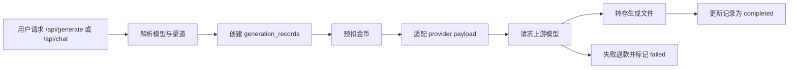

# 服务端设计

更新时间：2026-06-21

## 总体结构

后端位于 `server/src/`，使用 Express、Sequelize、MySQL、Redis、Multer、Sharp、Winston 构建。

```text
server/src
├── app.js                 # Express 入口、全局中间件、静态托管
├── routes/                # 用户侧与管理侧 API
├── services/              # 认证、计费、生成、文件、项目等业务逻辑
├── models/                # Sequelize 模型
├── middleware/            # 鉴权、限流、请求 ID、审计上下文
├── config/                # 数据库、Redis、认证、运行期密钥
├── utils/                 # 响应、日志、加密、IP/UA、通用工具
└── scripts/               # 创建管理员、升级、回填脚本
```

## 请求链路

1. `app.js` 加载环境变量和运行期密钥。
2. 挂载 Helmet、CORS、JSON body、morgan 日志。
3. 注入 `requestId` 和审计上下文。
4. `/api` 走全局限流。
5. `/api/*` 进入业务路由。
6. 用户路由通过 `auth.required` 或 `auth.optional` 控制访问。
7. 管理路由统一通过 `auth.required + adminMiddleware`。
8. 业务异常使用统一 `success/error/paginate` 响应格式。

## 认证与会话

认证模块位于：

- `server/src/services/auth.js`
- `server/src/middleware/auth.js`
- `server/src/routes/auth.js`

核心规则：

| 项目 | 说明 |
| --- | --- |
| Access Token | JWT，默认 15 分钟 |
| Refresh Token | JWT，默认 30 天，哈希后写入 `refresh_tokens` |
| Token 类型 | payload 包含 `token_type: access/refresh` |
| 登出 | 撤销 refresh token，access token 加入黑名单 |
| 刷新 | 验证 refresh token 后轮换新 refresh token |
| 用户状态 | banned、disabled、pending_email 会被拒绝 |

## 模型与渠道

模型管理模块位于：

- `server/src/services/model-management.js`
- `server/src/routes/admin/models.js`
- `server/src/routes/admin/channels.js`

概念：

| 概念 | 表 | 说明 |
| --- | --- | --- |
| 模型 | `models` | 用户看到和选择的模型 |
| 渠道 | `model_channels` | 上游 provider 地址、类型、密钥 |
| 绑定 | `model_channel_bindings` | 模型到渠道的多线路绑定 |
| 计费 | `billing_rules` | 模型固定金币价格 |

API Key 通过 `server/src/utils/encryption.js` 使用 AES-256-GCM 加密存储，管理接口不会返回明文或密文。

## 生成链路

生成模块位于 `server/src/services/generation.js`。



支持 provider：

| Provider | 类型 |
| --- | --- |
| `openai` | chat、image、video |
| `aliyun` | chat、image、video |
| `doubao` | chat、image |
| `stepfun` | chat、image |
| `agnes` | chat、image、video |
| `custom` | OpenAI 兼容接口 |

## 文件存储

模块位于 `server/src/services/storage.js`。

能力：

- 上传图片写入本地存储。
- 生成结果远程下载并转存。
- 通过 `files` 表记录归属、MIME、大小、hash、状态。
- 用户删除为软删除，物理文件保留。
- `/storage/*` 访问时先查表，软删除文件不可访问。

安全措施：

- 文件名使用随机 UUID。
- 路径归一化并阻止 `..`。
- 图片/视频使用文件头嗅探。
- 远程 URL 限制 HTTP/HTTPS。
- 私网 IP、回环地址、链路本地地址会被拦截。

## 计费与金币

模块位于：

- `server/src/services/billing.js`
- `server/src/services/coins.js`

计费过程：

1. 根据模型读取 `billing_rules`。
2. 根据用户组读取 `cost_multiplier`。
3. 检查每日生成上限。
4. 使用用户维度锁预扣金币。
5. 生成失败时退款。
6. 每次变动写入 `coin_transactions`。

## 项目持久化

项目模块位于 `server/src/services/project.js`。

项目保存内容：

- 名称、描述。
- `canvas_data`：nodes、edges、viewport。
- 缩略图文件 ID。
- 节点数量。
- 是否公开。

用户只能访问自己的项目。删除项目时会把关联生成记录的 `projectId` 置空，再删除项目记录。
