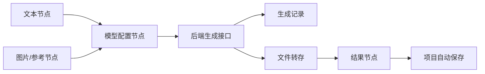

# 工作流说明

更新时间：2026-06-21

Doodle-Canvas 的核心体验是节点式 AI 创作画布。用户在画布中创建文本、图片、视频和模型配置节点，通过连线组织生成链路。

## 主要页面

| 页面 | 说明 | 截图 |
| --- | --- | --- |
| 首页 | 产品入口与能力展示 | `doc/home.png` |
| 画布 | 节点编排、生成与项目保存 | `doc/canvas.png` |
| 工作流示例 | 预设工作流展示 | `doc/workflow.png`、`doc/workflow2.png` |
| API 配置 | 管理端模型渠道配置 | `doc/api-config.png` |

## 节点类型

| 节点 | 说明 |
| --- | --- |
| TextNode | 输入提示词、角色描述、故事文本等 |
| ImageConfigNode | 图片模型、尺寸、参考图、生成参数 |
| ImageNode | 图片结果展示、后续节点参考输入 |
| VideoConfigNode | 视频模型、首尾帧、时长、比例等 |
| VideoNode | 视频结果展示与任务状态 |
| LLMConfigNode | 对话模型配置，用于提示词生成、故事拆分等 |

## 数据流



## 后端调用边界

前端不直接保存第三方 API Key，不直接请求上游模型。所有生成请求统一走后端：

| 类型 | 接口 |
| --- | --- |
| 图片 | `POST /api/generate/image` |
| 视频 | `POST /api/generate/video` |
| 视频状态 | `GET /api/generate/video/:taskId` |
| 对话 | `POST /api/chat/completions` |
| 流式对话 | `POST /api/chat/completions/stream` |

## 项目保存

项目数据保存在 `projects.canvas_data`：

```json
{
  "nodes": [],
  "edges": [],
  "viewport": {}
}
```

后端会记录：

- 项目名称与描述。
- 节点数量。
- 缩略图文件 ID。
- 是否公开。
- 创建与更新时间。

## 预设工作流

前端预设工作流定义在：

- `src/config/workflows.js`
- `src/hooks/useWorkflowOrchestrator.js`

当前覆盖：

| 工作流 | 说明 |
| --- | --- |
| 文生图 | 文本提示词生成图片 |
| 图生视频 | 图片作为首帧生成视频 |
| 分镜 | 根据角色或故事生成多个镜头 |
| 多角度角色 | 正面、侧面、近景、背面等多角度角色图 |
| 电商产品图 | 根据产品信息与参考图生成不同视角素材 |
| 儿童绘本 | 故事拆分、角色设定、逐页插画 |

